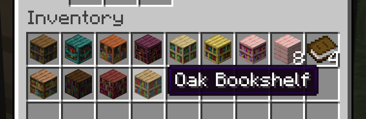

  <h1>
    Quark (Spout)
  </h1>

## Introduction

This is a [Spout](https://github.com/ModernSpout/Spout) port of [Quark](https://quarkmod.net/).

It is not complete: see which features are ported below.

## Features

### ✅ Sturdy Stone

### 🟡 Thatch

Thatch blocks do not catch your fall.

### ✅ Variant Bookshelves

<table>
  <tr>
    <td>
      
    </td>
    <td>
      
    </td>
    <td>
      
    </td>
  </tr>
</table>

### ✅ Variant Ladders

### 🟡 Utility Recipes

Raw ore blocks can be smelted into metal blocks.

### 🟡 Ashen Wood

Includes bookshelves, buttons, doors, fences, fence gates, ladders,
planks, pressure plates, slabs, stairs and trapdoors.

Currently not obtainable in survival mode.

### 🟡 Azalea Wood

Includes bookshelves, buttons, doors, fences, fence gates, ladders,
planks, pressure plates, slabs, stairs and trapdoors.

Currently not obtainable in survival mode.

### 🟡 Trumpet Wood

Includes bookshelves, buttons, doors, fences, fence gates, ladders,
planks, pressure plates, slabs, stairs and trapdoors.

Currently not obtainable in survival mode.

## Downloads

* [Latest version: 1.2 (MC 26.1.2)](https://github.com/ModernSpout/Quark-plugin/releases/download/1.2/Quark-1.2.jar)
* Development versions: download from
  [Actions](https://github.com/ModernSpout/Quark-plugin/actions/workflows/build.yml),
  under **Artifacts**
* [Older releases](https://github.com/ModernSpout/Quark-plugin/releases)

## Installation

Place the `.jar` file into the `plugins` folder.

Requires [Spout](https://github.com/ModernSpout/Spout).
